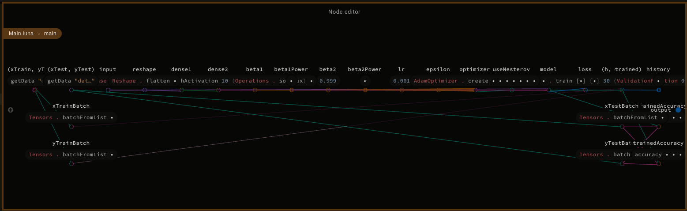
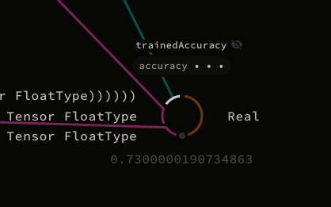

#Luna-Tensorflow MNIST Tutorial

<b>Cloning repository</b>

```bash
git clone -b MNIST_tutorial https://github.com/Luna-Tensorflow/Luna-Tensorflow.git
cd Luna-Tensorflow/Tutorial
```

<b>Downloading and preprocesing data</b>
Unfortunatelly, full dataset is quite heavy, so we need to cut it a little, with additional preprocessing.
```bash
chmod +x get_data.sh
./get_data.sh
venv/bin/python3 mnist_to_png.py
```

<b>Let's start with Luna Studio</b>
We need some helper functions, to load dataset and work with it.

```
import Std.Base
import Tensorflow.Tensor
import Tensorflow.Types
import Tensorflow.Layers.Input
import Tensorflow.Layers.Dense
import Tensorflow.Layers.Reshape
import Tensorflow.Operations
import Tensorflow.Losses.Crossentropy
import Tensorflow.Optimizers.Adam
import Tensorflow.Model

def labelsCount:
    10

def nTimes n val:
    def helper acc m:
        if m > 0 then helper (acc.prepend val) (m - 1) else acc
    helper [] n

def oneHot label:
    oneHotList = 0.upto (labelsCount - 1) . each l: if l == label then 1.0 else 0.0
    Tensors.fromList FloatType [labelsCount] oneHotList

def getData path:
    labels = 0.upto (labelsCount - 1)
    labelTensors = labels.each oneHot
    tensorLists = labels.each label: Tensors.fromPngDir (path + "/" + label.toText)
    ys = labelTensors.zip tensorLists . foldLeft [] ((label, tList): acc: (nTimes tList.length label) + acc)
    xs = tensorLists.foldLeft [] (acc: tList: tList + acc)
    (xs, ys)

def accuracy model xBatch yBatch:
    scores = model.evaluate xBatch
    scoresConst = Operations.makeConst scores
    preds = Operations.argMax scoresConst 1

    labelsConst = Operations.makeConst yBatch
    actual = Operations.argMax labelsConst 1

    comparisonBool = Operations.equal preds actual
    comparison = Operations.cast comparisonBool FloatType
    correct = Operations.sum comparison [0]
    all = Operations.size comparison
    allFloat = Operations.cast all FloatType
    accuracy = correct / allFloat

    accuracy.eval.atIndex 0
```

<b> Node editor </b>
`main` function in full effect.



```

def main:
    (xTrain, yTrain) = getData "data/train"
    (xTest, yTest) = getData "data/test"

    xTrainBatch = Tensors.batchFromList xTrain
    yTrainBatch = Tensors.batchFromList yTrain

    input = Input.create FloatType [28, 28, 3]
    reshape = Reshape.flatten input
    dense1 = Dense.createWithActivation 128 Operations.relu reshape
    dense2 = Dense.createWithActivation 10 Operations.softmax dense1

    beta1 = 0.9
    beta1Power = beta1
    beta2 = 0.999
    beta2Power = beta2
    lr = 0.001
    epsilon = 0.00000001
    useNesterov = False
    optimizer = AdamOptimizer.create beta1Power beta2Power lr beta1 beta2 epsilon useNesterov

    loss = Losses.categoricalCrossEntropy

    model = Models.make input dense2 optimizer loss

    xTestBatch = Tensors.batchFromList xTest
    yTestBatch = Tensors.batchFromList yTest

    untrainedAccuracy = accuracy model xTestBatch yTestBatch

    (h, trained) = model.train [xTrainBatch] [yTrainBatch] 30 (ValidationFraction 0.1) 0

    history = h

    trainedAccuracy = accuracy trained xTestBatch yTestBatch

    None

```

<b> Results </b>
Focusing on node named `trainedAccuracy` is necessary to observe the ratio of training process.



