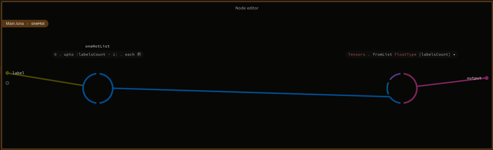
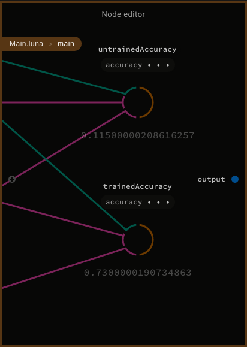
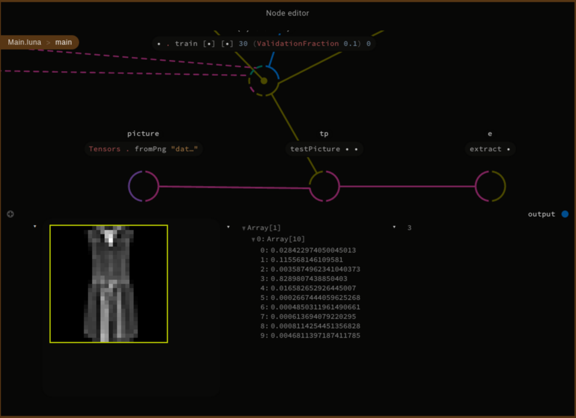

 <center>

# Luna-Tensorflow Fashion MNIST Tutorial 

Based on: <a href="https://www.tensorflow.org/tutorials/keras/basic_classification">Keras classification tutorial</a>.

</center>

## Cloning repository

```bash
git clone -b MNIST_tutorial https://github.com/Luna-Tensorflow/Luna-Tensorflow.git
cd Luna-Tensorflow/Tutorial
```

## Building libraries
```bash
cd local_libs/Tensorflow/native_libs/
mkdir build
cd build
cmake ../src
make
cd ../../../..
```

## Downloading and preprocesing data
Unfortunately, Fashion MNIST dataset is in an incompatible format, so we have to preprocess it first to PNG format supported by LunaTensorFlow.

```bash
chmod +x get_data.sh
./get_data.sh
venv/bin/python3 mnist_to_png.py
```

## Let's start with Luna Studio!

At the beggining we need some imports:

```
import Std.Base
import Tensorflow.Tensor
import Tensorflow.Types
import Tensorflow.Layers.Input
import Tensorflow.Layers.Dense
import Tensorflow.Layers.Reshape
import Tensorflow.Operations
import Tensorflow.Losses.Crossentropy
import Tensorflow.Optimizers.Adam
import Tensorflow.Model
```

The size of dataset labels is the number of different pictures to be classified.

```
def labelsCount:
    10
```

Then we introduce a number of helper functions, used to load dataset and work with it. The following one serves to replicate a given value `n` times, which we use later in order to assign pictures their one-hot encoded labels.

```
def nTimes n val:
    def helper acc m:
        if m > 0 then helper (acc.prepend val) (m - 1) else acc
    helper [] n
```

The training and testing labels are one-hot encoded. That encoding is simply a list of length `labelsCount`, filled with zeroes and one `1` on the index corresponding to the presented object.

```
def oneHot label:
    oneHotList = 0.upto (labelsCount - 1) . each l: if l == label then 1.0 else 0.0
    Tensors.fromList FloatType [labelsCount] oneHotList
```



An auxiliary function to load training and testing images from png format would be also helpful. The one shown below creates one-hot encoded labels for each object type in `labelTensors`. Then, it loads dataset of each object type into `tensorLists` and finally concatenates all the image tensors into `xs`, and their corresponding labels into `ys`.

```
def getData path:
    labels = 0.upto (labelsCount - 1)
    labelTensors = labels.each oneHot
    tensorLists = labels.each label: Tensors.fromPngDir (path + "/" + label.toText)
    ys = labelTensors.zip tensorLists . flatMap ((label, tList): (nTimes tList.length label))
    xs = tensorLists.concat
    (xs, ys)

```


Function that calculates models accuracy, given test dataset with its labels.

```
def accuracy model xBatch yBatch:
    scores = model.evaluate xBatch
    scoresConst = Operations.makeConst scores
    preds = Operations.argMax scoresConst 1

    labelsConst = Operations.makeConst yBatch
    actual = Operations.argMax labelsConst 1

    comparisonBool = Operations.equal preds actual
    comparison = Operations.cast comparisonBool FloatType
    correct = Operations.sum comparison [0]
    all = Operations.size comparison
    allFloat = Operations.cast all FloatType
    accuracy = correct / allFloat

    accuracy.eval.atIndex 0
```

And last but not least, helper function to prepare the optimizing function used in a learning process:

```
def prepareOptimizer:
    beta1 = 0.9
    beta1Power = beta1
    beta2 = 0.999
    beta2Power = beta2
    lr = 0.001
    epsilon = 0.00000001
    useNesterov = False

    AdamOptimizer.create beta1Power beta2Power lr beta1 beta2 epsilon useNesterov
```


## Building model, training and testing

Let's focus on the details of Luna Tensorflow API.

<table>

<tr><th> Code </th><th> Node editor </th></tr>

<tr><td>

```
def main:
    (xTrain, yTrain) = getData 
        "data/train"
    (xTest, yTest) = getData 
        "data/test"

    xTrainBatch = Tensors.batchFromList
        xTrain
    yTrainBatch = Tensors.batchFromList 
        yTrain

    xTestBatch = Tensors.batchFromList 
        xTest
    yTestBatch = Tensors.batchFromList 
        yTest

```
</td><td>

Loading data, preparing training and testing tensors into batches.


</td></tr> 

<tr><td>

```

    input = Input.create 
        FloatType 
        [28, 28, 3]

    reshape = Reshape.flatten 
        input

    dense1 = Dense.createWithActivation 
        128 
        Operations.relu 
        reshape

    dense2 = Dense.createWithActivation 
        10 
        Operations.softmax 
        dense1

```
</td><td>

Connecting models layers in sequential order:
<ul>
<li> input layer, feeded with 28x28 pixels pictures, </li>
<li> reshape layer, flattening to 1D, </li>
<li> hidden fully connected layer with 128 neurons, </li>
<li> output fully connected layer with 10 neurons as label predictions. </li>
</ul>


</td></tr> 

<tr><td>

```
    optimizer = prepareOptimizer

    loss = Losses.categoricalCrossEntropy

    model = Models.make 
        input 
        dense2 
        optimizer 
        loss

```
</td><td>

Building model with its parameters: 
<ul>
<li> input and output layers, </li>
<li> optimizer, </li>
<li> loss function. </li>
</ul>


</td></tr> 

<tr><td>

```

    untrainedAccuracy = accuracy 
        model 
        xTestBatch 
        yTestBatch

    (h, trained) = model.train 
        [xTrainBatch] 
        [yTrainBatch] 
        30 
        (ValidationFraction 0.1) 
        0

    history = h

    trainedAccuracy = accuracy 
        trained 
        xTestBatch 
        yTestBatch

    None
```
</td><td>

Training model, and calculating its accuracy on the test dataset before and after a whole process.


</td></tr> 

</table>


Evaluated model lets us observe the accuracy ratio after training process, on the node named `trainedAccuracy`. We can compare it with the accuracy ratio before training, displayed onn the node named `untrainedAccuracy`.

<center>



</center>

We can even check models prediction on particular image. The path `data/test/3/6.png` means, that we use picture `6.png`, from object class folder `3`, that is one hot encoded by function `getData` with the same label. The extract function feeded with models output, shows the same prediction as expected.

```
    picture = Tensors.fromPng "data/test/3/6.png"
    tp = testPicture trained picture
    e = extract tp

```

<center>



</center>

In the Node Editor we can look at `main` function in full effect.

<center>


</center>

